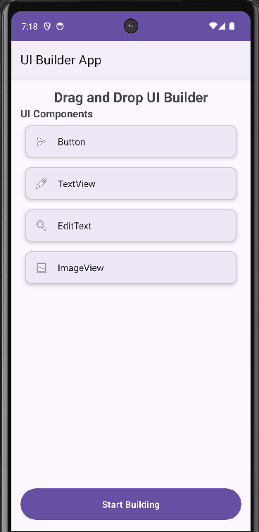
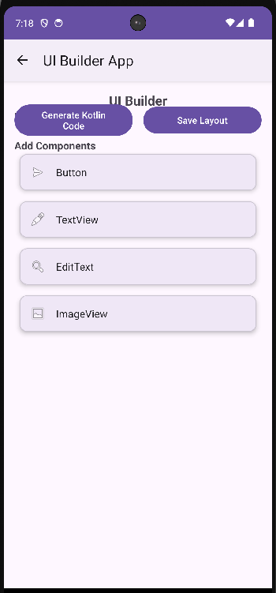
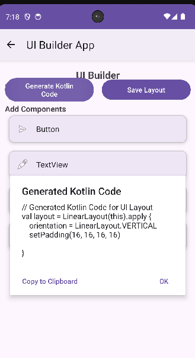

# UI Builder App

A simple Android application that allows users to design UI screens by adding components and seeing a live preview.

## Features

1. **Home Screen**
   - Shows the title "Drag and Drop UI Builder"
   - Displays a list of UI components that can be added to the screen
   - Components include: Button, TextView, EditText, ImageView

2. **UI Preview Area**
   - Large preview container where components appear when selected
   - Dynamic component addition using LinearLayout
   - Live preview of added components

3. **Component Behavior**
   - Button: Adds a clickable button with sample text
   - TextView: Displays sample text
   - EditText: Shows an input field with hint
   - ImageView: Displays a placeholder image

4. **Generate Code Feature**
   - "Generate Kotlin Code" button
   - Shows Kotlin code snippet representing the UI elements
   - Code can be copied to clipboard

5. **Layout Saving**
   - "Save Layout" button
   - Stores layout data locally in JSON format
   - Uses SharedPreferences for persistence

## Project Structure

```
app/
├── src/main/
│   ├── java/com/example/uibuilderapp/
│   │   ├── MainActivity.kt
│   │   ├── UIBuilderActivity.kt
│   │   └── ComponentAdapter.kt
│   ├── res/
│   │   ├── layout/
│   │   │   ├── activity_main.xml
│   │   │   ├── activity_ui_builder.xml
│   │   │   └── item_component.xml
│   │   ├── values/
│   │   │   ├── strings.xml
│   │   │   ├── colors.xml
│   │   │   └── themes.xml
│   │   └── drawable/
│   └── AndroidManifest.xml
├── build.gradle
└── proguard-rules.pro
```

## How to Run

1. Open Android Studio
2. Select "Open an existing project"
3. Navigate to the UIBuilderApp folder
4. Wait for Gradle to sync
5. Select an emulator or connect a physical device
6. Click the "Run" button or press Shift + F10

## Requirements

- Android Studio Hedgehog | 2023.1.1 or later
- Android SDK API 21 (Android 5.0) or higher
- Kotlin 1.9.10
- Gradle 8.2

## Dependencies
 
- AndroidX Core KTX
- AndroidX AppCompat
- Material Design Components
- ConstraintLayout
- RecyclerView
- JSON library

## Usage

1. Launch the app to see the home screen with component list
2. Tap "Start Building" or click on any component to open the UI builder
3. In the UI builder, click on components to add them to the preview area
4. Use "Generate Kotlin Code" to see the code representation
5. Use "Save Layout" to save your design locally

## 📱 Application Screenshot

Below is the output of the Notes Application.

### 🏠 Home Screen



### 🛠️ UI Builder Screen



### 💻 Generated Kotlin Code



## Author
**Shoaib Pasha**

Oxford College of Engineering

Computer Science and Engineering

Mail: shoaibpash1107@gmail.com

Github: https://github.com/Shoaib1107

## License
This project is open source and available under the MIT License.
